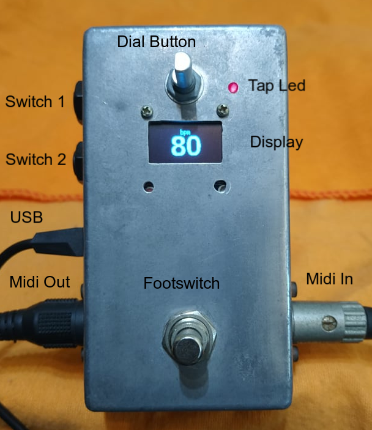
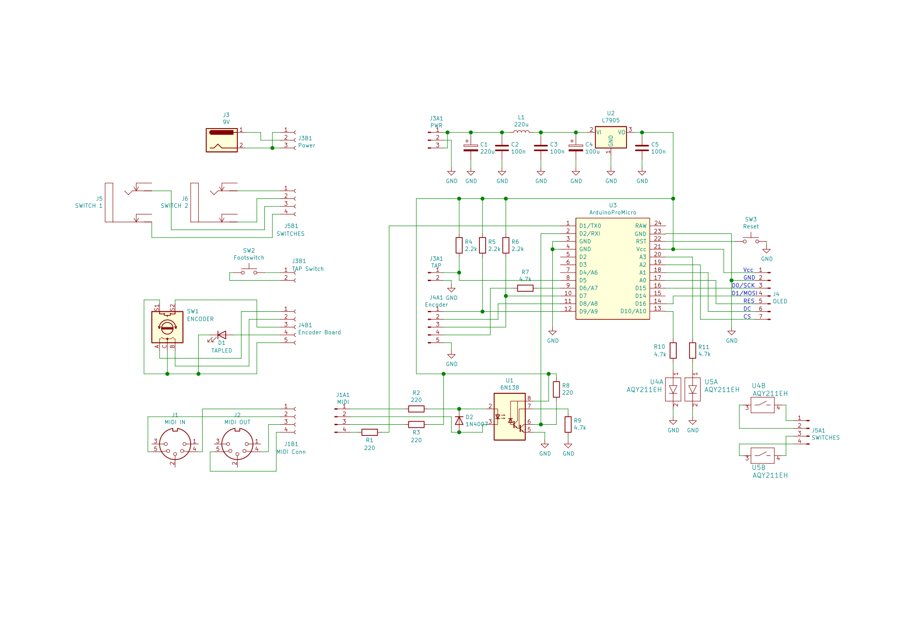
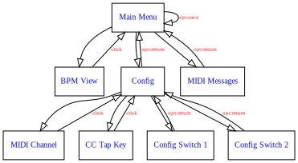
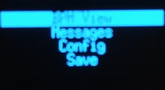
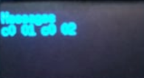
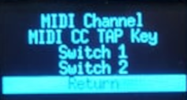
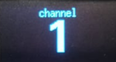
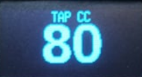
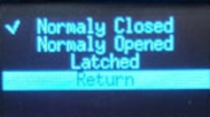

# Midiclock

Midiclock was designed to generate Midi Clock messages according to the BPM (beats per minute) set or tapped. The TAP source can be the front push button or a MIDI control message.



Three sources can set the BPM:

- using the dial button available on the front of the device;
- tapping the desired beat on using the footswitch on the front of the device; or
- sending a configured MIDI control change message to the device on the configured channel.

## Schematics

The figure below shows the Midiclock schematics:



### The display

Midiclock uses a blue oled display with 128 x 64 dots using SSD1306.

## Menu structure



### BPM View

It displays a big sized number indicating the current BPM set. While BPM View is active, the user can push the dial button to call the main menu.


### Main Menu

It allows to Access other options available on Midiclock, such as:

- display MIDI messages incoming into the devices
- call the Configuration Menu
- save current settings
- go back to BPM View


### Messages

It is a debugging tool that shows all MIDI messages incoming the device.

Pushing the dial button makes to come back to the Main Menu.



### Config

It allows configuring some behavior of the Midiclock Device, such as:

- the MIDI channel used to capture the TAP tempo
- the MIDI Control used to perform TAP tempo control
- the behavior of the Switch 1
- the behavior of the Switch 2



### Midi Channel

Midiclock can be set to use MIDI channel numbers from 0 to 15. If channel 0 (zero) is selected, the device will accept all channel sources.

Pushing the dial button over the "Return" option makes to come back to the Main Menu.



### Midi Control Change Message

Any Control Change control can be used as a TAP Tempo selector. 

It is important to remember that MIDI control messages have 3 bytes.  The first is the command itself and the MIDI channel, the second containing the subject control to be modified, and the third is the value to be set to that control.

Midiclock will only obey TAP commands having 127 as a control value.

A typical TAP command using Control Change messages for control 80 (decimal), on the MIDI channel 1, would be:

```
0xb1 0x50 0x7f
```

Pushing the dial button over the "Return" option makes to come back to the Main Menu.



### Switch 1 and 2 modes

Midclock devices control two digital switches, named "1" and "2". These keys are isolated from one another and have no connection to the device circuitry as they are optically driven.

The Switches can be configured as follows:

- normally closed
- normally open
- latched

The checkmark indicates the current mode. Use the dial button to select the desired behavior and dial the button to check it.

Pushing the dial button over the "Return" option makes to come back to the Main Menu.



## MIDI test commands

It follows some commands available on Linux for debugging purposes:

### Testing MIDI Program Change Messages

The device does not honor MIDI Program Change messages, but these messages can be viewed on the Messages Display.

``` shell
[hgamal@ygamal src]$ amidi -p hw:2,0,0 --send-hex=c001
[hgamal@ygamal src]$ amidi -p hw:2,0,0 --send-hex=c002
```

### Tap Tempo MIDI Control Change Messages

You can test the tapping via midi sending two or more messages as followed:

``` shell
[hgamal@ygamal src]$ amidi -p hw:2,0,0 --send-hex=b1507f
```

### Checking BPM Acurracy

In the repository exists a C++ program, called 'count.cpp'. Once compiled, it can be used to verify the accuracy of Beats per Minute produced by midiclock.

The program counts the number of MIDI Clock messages taking into account the time elapsed between them and calculates the obtained Beats per Minute.

``` shell
[hgamal@ygamal src]$ amidi -d -c -p hw:2,0,0 | ../count
```
